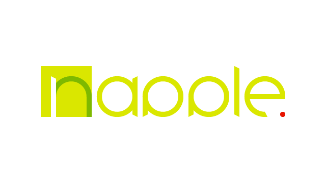
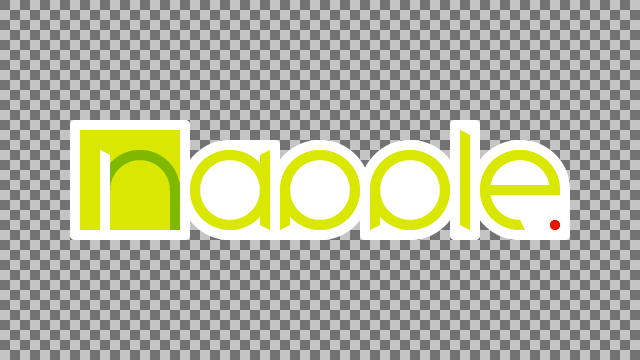
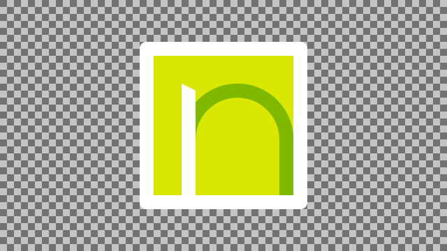
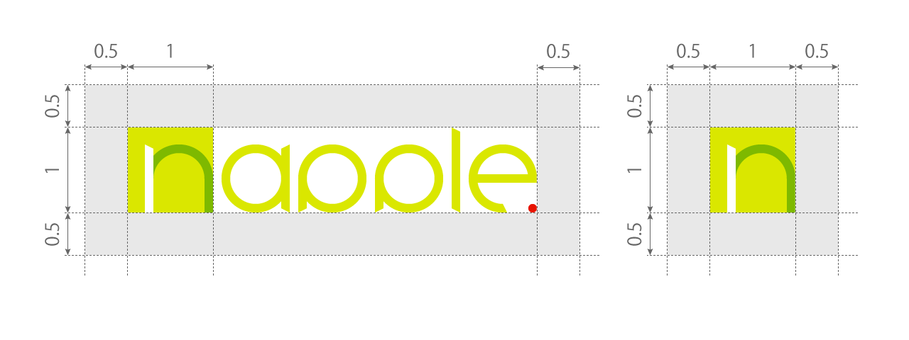
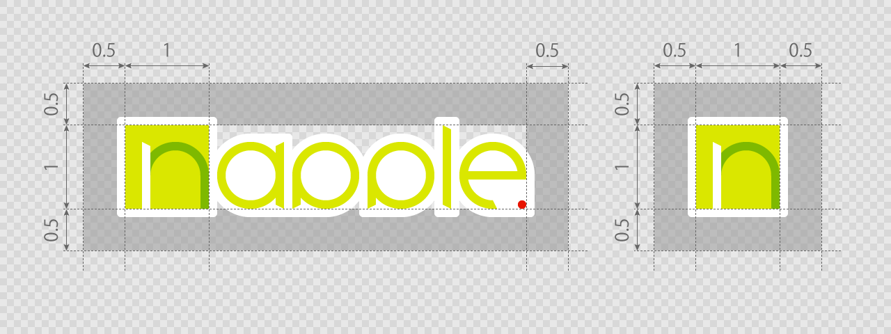
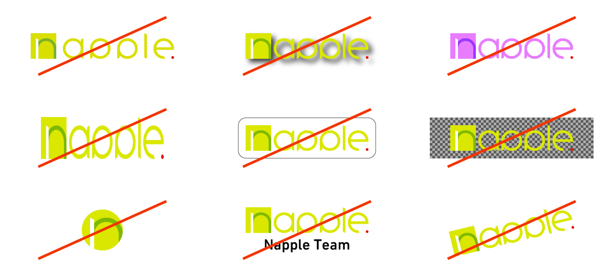

# Napple Branding Guidelines

これは Napple の名称及びロゴ・アイコンのブランディング規約とリソースを公開しているリポジトリです。

## Napple の名称及びロゴ・アイコンの表示について

Napple の名称及びロゴ・アイコンの利用に申請や許諾は必要ありませんが、これらは Napple Team もしくは Studio NAPPLE の作品であることを表示されるために使われるべきもので、 Napple の関係のしていないプロダクトに表示すべきではありません。

Napple のロゴ・アイコンの権利は Napple Team 及び Studio NAPPLE が所有しており、もしあなたが Napple のロゴを使用する際には、このページからダウンロードしたリソースを下記のブランディング規約に則って使用する必要があります。

## Napple の名称について

### Napple

「Napple Team」と「Studio NAPPLE」をまとめて呼称する場合には、先頭を大文字にした「Napple」を使用します。この名称はそのどちらかを一意に呼称する際には使用できません。ロゴには「.(ドット)」がデザインされていますが、文章上では表記されるものではありません。

#### BAD Example

* NAPPLE
* napple
* napple.

### Napple Team

「Napple Team」はそれぞれの単語の先頭を大文字で記し、それ以外の文字は小文字で記されます。ただしウェブサイトへのリンクであるとわかるような表現がされている場合にのみ「napple.team」と表記されることが許されます。

#### BAD Example

* NAPPLE TEAM
* Napple team
* napple team

### Studio NAPPLE

「Studio NAPPLE」は「Studio」の部分を先頭大文字、「Napple」の部分はすべて大文字で表記します。

#### BAD Example

* Studio Napple
* STUDIO NAPPLE
* Studio napple

## ロゴとブランドカラー

「Napple Team」と「Studio NAPPLE」は共に同じロゴ・アイコンで表示されます。

### 縁取りなしと縁取りありの使い方について

* 「縁取りなし」は以下の場合に使用することができます
  * 背景が白色でかつ他のオブジェクトが背景に存在しない場合
* 「縁取りあり」は以下の場合に使用することができます
  * 背景が白色以外の場合
  * 背景にパターンなど他のオブジェクトが存在する場合

### Napple ロゴ

| 縁取りなし | 縁取りあり |
|:----:|:----:|
|  |  |
| [Download zip](logo/normal.zip) | [Download zip](logo/border.zip) |

### Napple アイコン

| 縁取りなし | 縁取りあり |
|:----:|:----:|
|  |  |
| [Download zip](icon/normal.zip) | [Download zip](icon/border.zip) |

### ブランドカラー

|                            Color                         |   RGB   |       CMYK      |
|:--------------------------------------------------------:|:-------:|:---------------:|
|  | #DAE700 |  C20 M0 Y95 K0  |
|  | #7EB900 | C57 M10 Y100 K0 |
|  | #E71400 | C0 M100 Y100 K0 |

## アイソレーション

ロゴ・アイコンを使用する場合、ロゴの周囲には一定のアイソレーション（余白）が必要です。この領域内には文字またはその他のオブジェクトを置くことができません。アイソレーションは絶対値ではなく、 Napple のアイコンになっているボックスの幅と高さを 1 とした比率で表されます。

## 禁止事項

* 文字間隔を変更する
* ドロップシャドウなどの視覚効果を加える
* 色の変更
* 縦横比を変更する
* 枠線などを加える
* パターン・白以外の背景の場所に縁無しのロゴを使用する
* アイコンを円形に切り取る
* アイソレーション領域内に名称を入れる
* 傾ける
